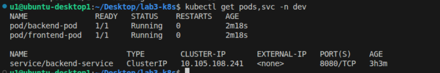
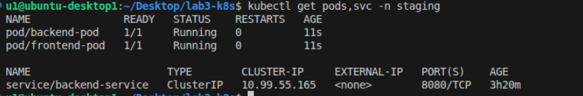
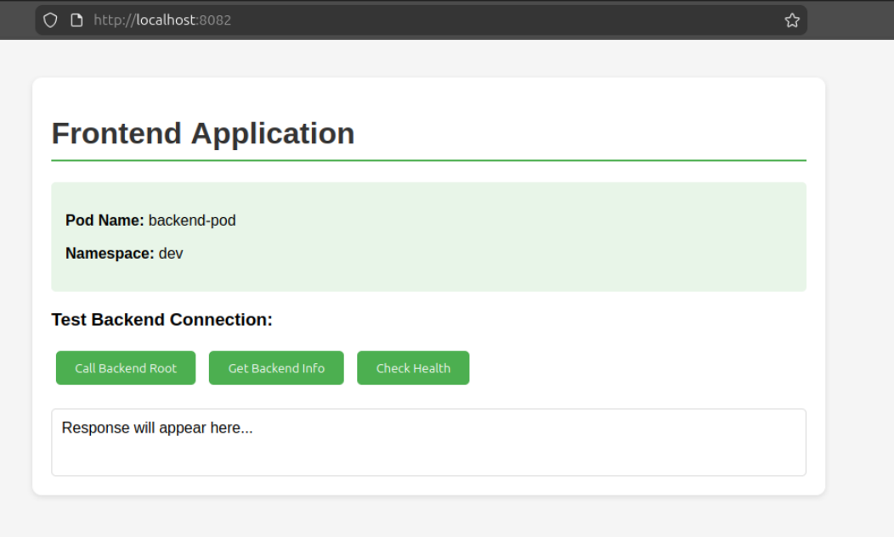

# Lab 3: Multi-Tenancy with Namespaces and Internal Routing

## Name
Fatma Osman Mahmoud

---

## Overview
In this lab, a single Kubernetes cluster is used to deploy two separate environments: **Development (dev)** and **Staging (staging)**.

Each environment contains a **frontend** and **backend** application. The environments are logically separated using **Kubernetes namespaces**.

The backend runs a simple Python HTTP server, while the frontend uses **Nginx** to communicate with the backend using the backend service name inside the same namespace.

---

## Project Structure

```
lab3-k8s/
│
├── backend-app.py
├── Dockerfile.backend
├── Dockerfile.frontend
├── nginx.conf
├── index.html
├── dev-environment.yaml
├── staging-environment.yaml
├── README.md
└── screenshots/
    ├── pods_dev.png
    ├── pods_staging.png
    └── app1.png
```

---

## 1. Build Docker Images

```bash
docker build -f Dockerfile.backend -t backend-app:latest .
docker build -f Dockerfile.frontend -t frontend-app:latest .
```

---

## 2. Load Images into Minikube

```bash
minikube image load backend-app:latest
minikube image load frontend-app:latest
```

---

## 3. Create Namespaces

```bash
kubectl create namespace dev
kubectl create namespace staging
```

---

## 4. Apply Kubernetes YAML Files

```bash
kubectl apply -f dev-environment.yaml
kubectl apply -f staging-environment.yaml
```

---

## 5. Check Pods and Services

### Dev Namespace

```bash
kubectl get pods,svc -n dev
```



---

### Staging Namespace

```bash
kubectl get pods,svc -n staging
```



---

## 6. Access the Frontend

### Dev Environment

```bash
kubectl port-forward pod/frontend-pod 8082:80 -n dev
```

Open browser:

```
http://localhost:8082
```



---

### Staging Environment

```bash
kubectl port-forward pod/frontend-pod 8083:80 -n staging
```

Open browser:

```
http://localhost:8083
```


---

## Notes

- The backend exposes three endpoints:
  - `/`
  - `/health`
  - `/info`

- The frontend communicates with the backend using **backend-service** inside the same namespace.

- Kubernetes **Namespaces** are used to isolate the dev and staging environments within the same cluster.

- Pod names and namespaces are displayed on the frontend for easier identification.
